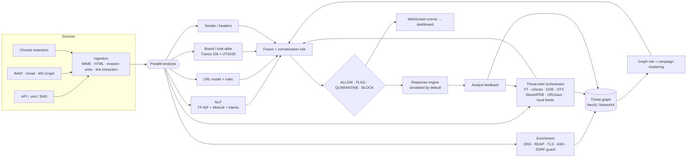

# PhishGraph

**Real-time phishing detection that reconstructs the attack infrastructure behind a message, not just the message.**

Bit N Build 2026 · PSN013 *Real-Time AI Phishing Detection System* (NLP + graph-based analysis, catch evasive phishing as it arrives, block or flag instantly).

Most phishing detectors ask one question: *is this URL already on a blacklist, or does a classifier think it looks bad?* PhishGraph asks a second one: *who else is using this infrastructure?* A brand-new domain that no feed has seen can still share an IP address, TLS certificate and nameserver with domains that are known to be malicious, and PhishGraph shows you that exact path.

```
unseen email ─► NLP 95 · URL 99 · Brand 86 · Sender 94 · Threat intel n/a · Graph 84 ─► BLOCK 93
                  └ graph: microsoft-login-security.example.xyz shares IP 203.0.113.45, TLS certificate and
                           nameserver ns1.shadydns-demo.net with known-bad domain outlook-mailbox-restore.xyz
                  └ campaign: CAMPAIGN-2026-0001 (semantic 0.69, infrastructure 1.0)
```
*(output of `scripts/demo_attack.py`; the infrastructure is labelled DEMO DATA, see [Demo](#demo))*

---

## What it does

| Layer | What happens |
|---|---|
| **Ingestion** | Raw RFC 822 / `.eml` / JSON / SMS / WhatsApp text; IMAP, Gmail API and Microsoft Graph connectors (opt-in). Attachments are hashed, never opened. |
| **Evasion undoing** | Zero-width characters, Cyrillic/Greek look-alike letters inside words, `hxxp` / `[.]` defanging, s p a c e d letters, base64-hidden links, invisible HTML text, meta refresh, forms inside the email. Each trick found is itself evidence. |
| **Link extraction** | Text, bare domains, `href`, buttons, form actions, safe-link / tracking wrappers (Outlook Safe Links, Google, Facebook, Proofpoint) unwrapped statically, link text that shows a different domain than it opens. |
| **NLP** | Stage 1 hashed TF-IDF logistic regression (exact per-term contributions) + stage 2 MiniLM sentence-embedding classifier + 20 intent categories from a multilingual phrase lexicon (English, Hindi, Tamil, Hinglish, Tanglish) and semantic prototypes that catch paraphrases. |
| **URL model** | Calibrated blend of a hashed character n-gram LR and a gradient-boosted model on 37 lexical features. |
| **Brand & look-alike engine** | 95 curated brands (Indian banks, UPI apps, TNEB, government portals, global brands) **plus the top 10,000 Tranco domains**, full Unicode UTS #39 confusables, Public Suffix List. Detects homographs, character substitution (`g00gle`), typosquats, combosquats, subdomain spoofs and TLD swaps. |
| **Sender analysis** | SPF / DKIM / DMARC results, display-name spoofing, Reply-To and Return-Path mismatch, free-mail posing as an institution, SMS from a personal number posing as a bank, risky and double-extension attachments; verified-sender signals lower risk. |
| **Enrichment** | DNS (A/AAAA/NS/MX), RDAP registration date & registrar, the TLS certificate the server presents, IP → ASN (Team Cymru). All behind an SSRF guard. |
| **Threat intelligence** | VirusTotal, urlscan.io (history first, submit only if enabled), Google Safe Browsing, AlienVault OTX, AbuseIPDB, URLhaus, plus a local IOC store fed by OpenPhish / PhishTank / URLhaus collectors and analyst confirmations. Every provider has timeout, retry with backoff, rate limit, circuit breaker and cache. |
| **Threat graph** | Neo4j (or NetworkX locally): Email → URL → Domain → IP → ASN, Domain → Certificate / Nameserver / Brand, feeds, senders, attachments, campaigns. Every edge has `first_seen`, `last_seen`, `source`, `confidence`. |
| **Graph risk** | `0.25 malicious neighbours + 0.20 infrastructure overlap + 0.15 suspicious cluster + 0.15 IP reputation + 0.10 certificate overlap + 0.10 temporal proximity + 0.05 campaign similarity`, with **hub dampening**: sharing a Cloudflare IP or a GoDaddy nameserver means nothing; sharing an uncommon nameserver or an identical certificate means a lot. |
| **Campaigns** | `0.5 semantic similarity + 0.3 shared infrastructure + 0.1 brand + 0.1 time` → `CAMPAIGN-2026-NNNN` with message, domain, IP, ASN and certificate counts. |
| **Fusion & decision** | Configurable weights; missing sources are redistributed, never counted as "safe"; source disagreement flagged; ALLOW < 30 ≤ FLAG < 60 ≤ QUARANTINE < 85 ≤ BLOCK. |
| **Response** | Simulated by default (database state only). Live IMAP quarantine only with `RESPONSE_LIVE_ACTIONS=true`. Nothing is ever deleted. BLOCK adds the indicators to the local feed. |
| **Feedback loop** | Confirm → IOCs into the local feed, graph nodes marked malicious, positive sample queued. False positive → graph cleared, hard negative queued. Retraining is human-approved. |
| **Monitoring** | Model registry with versions and metrics, score-distribution drift (PSI), false-positive rate, new TLDs / impersonated brands, Prometheus `/metrics`, provider health. |
| **Clients** | React dashboard (11 pages, ~65 KB gzip first load) and a Chrome MV3 extension (page protection, Gmail banners, right-click checks). |

## Principles that keep it from hallucinating

1. **Every reason is evidence, not prose.** Reasons are copied from the engine that produced them (with the engine name). No language model writes explanations.
2. **A missing source is "unavailable", not "clean".** Threat-intel providers without keys say `NOT CONFIGURED`; failures say `SOURCE UNAVAILABLE`; fusion re-weights instead of assuming zero risk.
3. **No single model can quarantine a message.** QUARANTINE/BLOCK requires ≥ 2 independent evidence families (language intent, link rules, brand, sender, threat intel, graph) or one hard indicator.
4. **Official and established sites are never called look-alikes.** Brand-owned domains, their subdomains and brand TLDs (`.google`, `.sbi` …) are recognised; the Tranco top 100,000 is never flagged as a look-alike of something else.
5. **Shared infrastructure is weighted by how shared it is.** CDN / cloud ASNs and registrar default nameservers are dampened so two unrelated sites on Cloudflare are not "linked".
6. **Demo data is labelled.** Seeded infrastructure uses RFC 5737 documentation IPs and RFC 5398 ASNs and is tagged `DEMO DATA` everywhere it appears.
7. **Numbers are measured, and the uncomfortable ones are shown.** See [Evaluation](#evaluation).

## Evaluation

All numbers below come from files in this repository (`models/*/report.json`, `data/processed/lookalike_eval.json`) and can be reproduced with `python scripts/train_all.py`.

### Look-alike engine (`scripts/eval_lookalike.py`)
| Test | Result |
|---|---|
| Official brand domains and their subdomains (852 hosts) | **0 flagged** |
| Real domains, Tranco ranks 100,001–150,000 (50,000 domains, mostly legitimate) | **0.19 %** strongly flagged (96); several of these are genuine typosquats in the wild, e.g. `intagram.com` |
| Generated look-alikes of curated brands (homoglyph, omission, repetition, transposition, keyboard, combosquat, subdomain) | **86.3 %** strongly flagged |
| All 8,354 generated look-alikes incl. generic popular sites | 82.3 % receive a signal (strong or weak) |
| Throughput | ~5,500 domains/s single core |

`google.com`, `mail.google.com`, `google.co.in`, `googleapis.com`, `opensource.google` → clean. `g00gle.com`, `goog1e.com`, `gооgle.com` (Cyrillic о), `xn--ggle-55da.com`, `googel.com`, `google.com.verify-login.xyz`, `google-security-alert.com` → flagged with the exact reason. These cases are pinned in `backend/tests/test_domains.py`.

### URL model (1,025,138 unique URLs from 2 datasets; 420,000 sampled; F1 / PR-AUC of the deployed blend)
| Split | F1 | PR-AUC |
|---|---|---|
| Random stratified | 0.945 | 0.989 |
| Domain-grouped (no registrable domain in both train and test) | 0.937 | 0.986 |
| Cross-dataset ealvaradob → PhiUSIIL | 0.644 | 0.843 |
| Cross-dataset PhiUSIIL → ealvaradob | 0.613 | 0.471 |

**Read this honestly:** URL classifiers learn dataset artifacts (PhiUSIIL's legitimate URLs are almost all bare homepages). Trained on one source and tested on another, performance collapses. That is why PhishGraph never lets the URL model decide alone: on its own it counts as moderate evidence, and official / established domains cap it.

### Email / SMS NLP (19,855 de-duplicated messages)
| Split | TF-IDF LR F1 | MiniLM LR F1 | Blend F1 | Blend PR-AUC |
|---|---|---|---|---|
| Random stratified | 0.966 | 0.923 | 0.961 | 0.995 |
| Cross-channel email → SMS | 0.779 | 0.775 | 0.792 | 0.910 |
| Cross-channel SMS → email | 0.834 | 0.856 | **0.902** | 0.964 |

Under distribution shift the semantic stage earns its place (SMS → email: 0.834 → 0.902). The second email corpus we downloaded (zefang-liu, 18,650 emails) turned out to be **entirely contained** in the first after normalisation, so no cross-source email number is reported; it would be meaningless.

### End-to-end demo set (27 hand-written messages, not an accuracy claim)
12 / 12 legitimate messages allowed (bank alert SMS, GitHub password reset, Amazon shipping, Microsoft security notice …), 15 / 15 phishing messages caught (8 BLOCK, 4 QUARANTINE, 3 FLAG).

### Performance (single process, Apple M-series laptop, `scripts/load_test.py`, fast path)
| Endpoint | Throughput | p50 / p95 at 16 concurrent clients |
|---|---|---|
| `POST /analyze/url` | 33.5 req/s | 475 / 655 ms |
| `POST /analyze/email` | 25.1 req/s | 633 / 835 ms |

Single-request latency is ~30–40 ms of CPU; the p50 above is queueing inside one Python process. Scale by running more API processes behind the shared Postgres / Redis / Neo4j of the Compose stack. Deep enrichment (DNS, RDAP, TLS, external intel) runs asynchronously and re-scores the detection, emitting `detection_updated`.

## Architecture



Code map: see [`AGENTS.md`](../../AGENTS.md) at the repository root for a file-by-file guide.

## Quick start (local, no Docker, no API keys)

```bash
cd ps13/phishgraph
python3 -m venv .venv && . .venv/bin/activate
pip install -r requirements-dev.txt            # add -r requirements-embeddings.txt for the semantic stage
python scripts/download_datasets.py --reference-only   # Tranco, Public Suffix List, Unicode confusables
(cd frontend && npm ci && npm run build)       # dashboard served by the API
python scripts/seed_demo.py --reset            # DEMO DATA: feed, infrastructure, 27 messages
python -m uvicorn --app-dir backend app.main:app --port 8000
```
Open http://localhost:8000 (API key `dev-local-key`, change it with `API_KEYS`). OpenAPI docs: http://localhost:8000/docs.

Local mode uses SQLite, an in-memory cache/queue and a NetworkX graph persisted to `data/graph.json`. Set `DATABASE_URL`, `REDIS_URL` and `NEO4J_URI` to use the production backends.

## Docker

```bash
cp .env.example .env            # set API_KEYS and NEO4J_PASSWORD at least
docker compose up --build       # postgres, redis, neo4j, backend (API + dashboard), worker
WITH_EMBEDDINGS=true docker compose up --build   # include the MiniLM semantic stage (adds PyTorch)
```
Dashboard and API on http://localhost:8000, Neo4j browser on http://localhost:7474.

> **Verification status:** the Compose file was written for this project but has not been run on the development machine (Docker was not installed there). Everything else in this README was run and tested.

## Demo

```bash
python scripts/seed_demo.py --reset     # seed DEMO DATA
python scripts/demo_attack.py           # the scripted story, driven through the live API
```
1. An email arrives whose link is on **no** feed.
2. NLP, URL model, brand and sender engines score it; enrichment and the graph run.
3. The graph shows the new domain shares IP, certificate and nameserver with known-bad domains.
4. Fusion → BLOCK; campaign updated; the dashboard receives the event live.
5. The analyst confirms; indicators enter the local feed.
6. A new variant on a different, never-seen domain is caught through the same infrastructure.

## API

| Method | Path | |
|---|---|---|
| POST | `/api/v1/analyze/email` | JSON or raw RFC 822 (`raw`), `deep=true` waits for enrichment |
| POST | `/api/v1/analyze/eml` | multipart `.eml` upload |
| POST | `/api/v1/analyze/url` | single URL, fast path |
| POST | `/api/v1/investigate` | 202 + job id; full chain for an unknown URL |
| GET | `/api/v1/jobs/{id}` | job status / result |
| GET | `/api/v1/detections`, `/api/v1/detection/{id}` | list / full explainable report |
| GET | `/api/v1/campaigns`, `/api/v1/campaign/{id}` | campaigns with graph |
| GET | `/api/v1/domain/{d}`, `/api/v1/ip/{ip}` | entity views |
| GET | `/api/v1/graph/detection/{id}`, `/graph/domain/{d}`, `/graph/overview` | graph JSON |
| POST | `/api/v1/feedback` | `confirmed_phishing` · `false_positive` · `unsure` |
| GET/POST | `/api/v1/threat-feed` | local IOCs / add IOC |
| GET | `/api/v1/statistics`, `/api/v1/providers`, `/api/v1/models` | dashboards, provider health, model health + drift |
| WS | `/api/v1/events?api_key=` | live `new_detection`, `detection_updated`, `feedback` |
| GET | `/health`, `/ready`, `/metrics` | ops |

```bash
curl -s -X POST localhost:8000/api/v1/analyze/url -H 'X-API-Key: dev-local-key' \
     -H 'content-type: application/json' -d '{"url":"https://g00gle.com/login"}' | jq '.risk_score,.decision,.reasons[0].text'
```

## Chrome extension

`extension/` is a Manifest V3 extension. Load it from `chrome://extensions` → Developer mode → *Load unpacked*, then enter your server URL and API key in its options. It asks for access only to the server you enter.
- Checks the pages you open; QUARANTINE/BLOCK pages are replaced by a warning listing the evidence (with *continue anyway*).
- Optional Gmail scanning: a verdict banner above each opened message and risky links outlined.
- Right-click *Check link* / *Check selected text*.
- Offline fallback flags raw-IP, punycode and `user@host` links when the server is unreachable.

## Security model

See [SECURITY.md](SECURITY.md). In short: API keys (constant-time compare) and per-key rate limits; strict input size limits; SSRF guard on every network step (private, loopback, link-local, metadata and obfuscated-IP targets refused, DNS answers re-checked); only public indicators are ever sent to third parties (URLs carrying e-mail addresses or tokens are reduced to their host); simulated response by default; audit log of feedback, IOC additions, investigations and actions; secrets only via environment.

## Datasets

See [data/DATASETS.md](data/DATASETS.md) for sources, licences, sizes, hashes and the known issues we found.

## Limitations

- URL models do not generalise across data sources (see the cross-dataset numbers); they are one signal among six.
- The text classifier over-flags transactional notices when used alone; the corroboration rule and verified-sender signals compensate, and analyst false positives are collected as hard negatives.
- The local NetworkX graph lives in one process; use Neo4j for multi-process deployments.
- The Chrome extension's Gmail integration depends on Gmail's DOM, which can change.
- Brand coverage beyond the curated 95 relies on the Tranco top 10,000; lesser-known local brands need to be added to `data/brands.json`.

## Roadmap

Visual similarity of landing pages (screenshot perceptual hash against brand login pages), certificate-transparency monitoring for newly issued look-alike certificates, learned fusion weights from reviewed detections, an iOS SMS filter extension and Android notification guard, and Outlook add-in.
