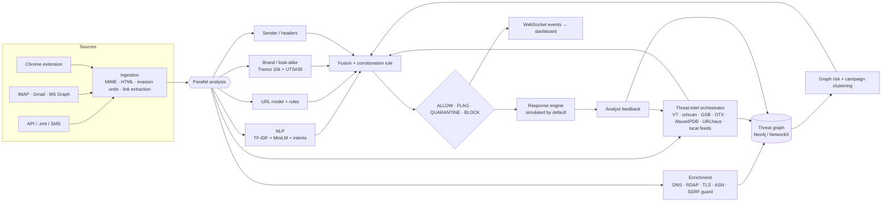

# PhishGraph

**Real-time phishing detection that reconstructs the attack infrastructure behind a message, not just the message.**

Bit N Build 2026 · PSN013 *Real-Time AI Phishing Detection System* (NLP + graph-based analysis, catch evasive phishing as it arrives, block or flag instantly).

Most phishing detectors ask one question: *is this URL already on a blacklist, or does a classifier think it looks bad?* PhishGraph asks a second one: *who else is using this infrastructure?* A brand-new domain that no feed has seen can still share an IP address, TLS certificate and nameserver with domains that are known to be malicious, and PhishGraph shows you that exact path.

```
unseen email ─► NLP 95 · URL 99 · Brand 86 · Sender 94 · Threat intel n/a · Graph 84 ─► BLOCK 93
                  └ graph: microsoft-login-security.example.xyz shares IP 203.0.113.45, TLS certificate and
                           nameserver ns1.shadydns-demo.net with known-bad domain outlook-mailbox-restore.xyz
                  └ campaign: CAMPAIGN-2026-0001 (semantic 0.69, infrastructure 1.0)
```
*(output of `scripts/demo_attack.py`; the infrastructure is labelled DEMO DATA, see [Demo](#demo))*

**New here? Read [docs/HOW-IT-WORKS.md](docs/HOW-IT-WORKS.md)**: one message end to end, the guarantee, the measured results and a two-minute demo.

---

## What it does

| Layer | What happens |
|---|---|
| **Ingestion** | Raw RFC 822 / `.eml` / JSON / SMS / WhatsApp text; **screenshots of SMS, WhatsApp, Gmail and Outlook** (OCR in the browser, see [Screenshots](#check-a-screenshot)); IMAP, Gmail API and Microsoft Graph connectors (opt-in). Attachments are hashed, never opened. |
| **Evasion undoing** | Zero-width characters, Cyrillic/Greek look-alike letters inside words, `hxxp` / `[.]` defanging, s p a c e d letters, base64-hidden links, invisible HTML text, meta refresh, forms inside the email. Each trick found is itself evidence. |
| **Link extraction** | Text, bare domains, `href`, buttons, form actions, safe-link / tracking wrappers (Outlook Safe Links, Google, Facebook, Proofpoint) unwrapped statically, link text that shows a different domain than it opens. |
| **NLP** | Stage 1 hashed TF-IDF logistic regression (exact per-term contributions) + stage 2 MiniLM sentence-embedding classifier + 20 intent categories from a multilingual phrase lexicon (English, Hindi, Tamil, Hinglish, Tanglish) and semantic prototypes that catch paraphrases. |
| **URL model** | Calibrated blend of a hashed character n-gram LR and a gradient-boosted model on 37 lexical features. |
| **Brand & look-alike engine** | 95 curated brands (Indian banks, UPI apps, TNEB, government portals, global brands) **plus the top 10,000 Tranco domains**, full Unicode UTS #39 confusables, Public Suffix List. Detects homographs, character substitution (`g00gle`), typosquats, combosquats, subdomain spoofs and TLD swaps. |
| **Sender analysis** | SPF / DKIM / DMARC results, display-name spoofing, Reply-To and Return-Path mismatch, free-mail posing as an institution, SMS from a personal number posing as a bank, risky and double-extension attachments; verified-sender signals lower risk. |
| **Enrichment** | DNS (A/AAAA/NS/MX), RDAP registration date & registrar, the TLS certificate the server presents, IP → ASN (Team Cymru). All behind an SSRF guard. |
| **Threat intelligence** | **Keyless, always on:** OpenPhish, URLhaus, CERT Polska and Phishing Army (~280,000 live indicators) in a local IOC store, plus analyst confirmations. **With your API keys:** VirusTotal, urlscan.io (history first, submit only if enabled), Google Safe Browsing, AlienVault OTX, AbuseIPDB, PhishTank. Every provider has timeout, retry with backoff, rate limit, circuit breaker and cache; providers without a key say `NOT CONFIGURED`, never "clean". |
| **Threat graph** | Neo4j (or NetworkX locally): Email → URL → Domain → IP → ASN, Domain → Certificate / Nameserver / Brand, feeds, senders, attachments, campaigns. **Live feed infrastructure** is added as it arrives: which brand each phishing site impersonates and which hosting platform it abuses (e.g. today: `vercel.app`, `pages.dev`, `blogspot.com`; Microsoft, Meta, Apple, Chase). Every edge has `first_seen`, `last_seen`, `source`, `confidence`. |
| **Graph risk** | `0.25 malicious neighbours + 0.20 infrastructure overlap + 0.15 suspicious cluster + 0.15 IP reputation + 0.10 certificate overlap + 0.10 temporal proximity + 0.05 campaign similarity`, with **hub dampening**: sharing a Cloudflare IP or a GoDaddy nameserver means nothing; sharing an uncommon nameserver or an identical certificate means a lot. |
| **Campaigns** | `0.5 semantic similarity + 0.3 shared infrastructure + 0.1 brand + 0.1 time` → `CAMPAIGN-2026-NNNN` with message, domain, IP, ASN and certificate counts. |
| **Fusion & decision** | Configurable weights; missing sources are redistributed, never counted as "safe"; source disagreement flagged; ALLOW < 30 ≤ FLAG < 60 ≤ QUARANTINE < 85 ≤ BLOCK. |
| **Response** | Simulated by default (database state only). Live IMAP quarantine only with `RESPONSE_LIVE_ACTIONS=true`. Nothing is ever deleted. BLOCK adds the indicators to the local feed. |
| **Feedback loop** | Confirm → IOCs into the local feed, graph nodes marked malicious, positive sample queued. False positive → graph cleared, hard negative queued. Retraining is human-approved. |
| **Monitoring** | Model registry with versions and metrics, score-distribution drift (PSI), false-positive rate, new TLDs / impersonated brands, Prometheus `/metrics`, provider health. |
| **Clients** | React dashboard (13 pages, ~64 KB gzip first load, installable on iPhone / iPad / Android home screens, ⌘K command palette) and a Chrome MV3 extension (page protection, Gmail banners, right-click checks) that works without any setup. |

## Principles that keep it from hallucinating

1. **Every reason is evidence, not prose.** Reasons are copied from the engine that produced them (with the engine name). No language model writes explanations.
2. **A missing source is "unavailable", not "clean".** Threat-intel providers without keys say `NOT CONFIGURED`; failures say `SOURCE UNAVAILABLE`; fusion re-weights instead of assuming zero risk.
3. **No single model can quarantine a message.** QUARANTINE/BLOCK requires ≥ 2 independent evidence families (language intent, link rules, brand, sender, threat intel, graph) or one hard indicator.
4. **Official and established sites are never called look-alikes.** Brand-owned domains, their subdomains and brand TLDs (`.google`, `.sbi` …) are recognised; the Tranco top 100,000 is never flagged as a look-alike of something else.
5. **Shared infrastructure is weighted by how shared it is.** CDN / cloud ASNs and registrar default nameservers are dampened so two unrelated sites on Cloudflare are not "linked".
6. **Demo data is labelled.** Seeded infrastructure uses RFC 5737 documentation IPs and RFC 5398 ASNs and is tagged `DEMO DATA` everywhere it appears.
7. **Numbers are measured, and the uncomfortable ones are shown.** See [Evaluation](#evaluation).
8. **One rule is guaranteed, not estimated.** See [The brand guarantee](#the-brand-guarantee).

## Evaluation

All numbers come from files in this repository and are reproducible: `models/*/report.json` and `models/registry.json`
(`python scripts/train_all.py`), `data/processed/lookalike_eval.json` (`scripts/eval_lookalike.py`),
`data/processed/fresh_feed_eval.json` (`scripts/eval_fresh_feed.py`) and `data/validation/history.json` (every test run).
The dashboard's **Training & validation** page shows all of it, with every model version and every run.

### What a detector sees today: live, unseen phishing (URL model alone)
Today's OpenPhish feed (300 live phishing URLs, none in the training data) against 2,639 real sites (Tranco ranks 20,001–23,000, held out):

| URL model version | Live phishing caught | Real sites wrongly flagged | ROC-AUC | PR-AUC |
|---|---|---|---|---|
| v1–v2 (as first trained) | 94 % | **76 %** | 0.76 | 0.27 |
| v3: canonical URLs (scheme and `www.` removed from every feature) | 95 % | 37 % | 0.91 | 0.54 |
| **v5 (deployed): + 57,283 real homepages from Tranco as legitimate examples** | **96 %** | **16 %** | **0.96** | **0.79** |

**The story behind these numbers.** Evaluating on today's feed exposed a dataset artifact the usual splits hide: in the
training data, legitimate URLs almost always start with `www.`, so the model had learned "no `www.` = phishing" and
flagged 76 % of ordinary sites. Canonicalising URLs and adding real homepages fixed most of it. 16 % is still far too many
for a model on its own, which is exactly why the URL model **never decides alone** (it is one signal of six, established
sites are capped, and a single signal cannot quarantine). End to end, `scripts/feature_check.py` sends 43 URLs through the
full pipeline: all 23 look-alikes and scam hosts are flagged and all 20 real brand / everyday sites are allowed.

### URL model on the classic splits (1,025,138 unique URLs from 2 datasets; 420,000 sampled; F1 of the deployed blend)
| Split | v1 | v5 (deployed) |
|---|---|---|
| Random stratified | 0.945 | 0.902 |
| Domain-grouped (no registrable domain in both train and test) | 0.937 | 0.889 |
| Cross-dataset ealvaradob → PhiUSIIL | 0.644 | 0.644 |
| Cross-dataset PhiUSIIL → ealvaradob | 0.613 | 0.578 |

In-distribution F1 went **down** from v1 to v5 because v1 was partly scoring the `www.` artifact; the live-feed table above
is the number that matters. Cross-dataset performance stays poor, which is the honest state of URL-only classification.

### Email / SMS NLP (19,855 de-duplicated messages + reviewed analyst feedback)
| Split | TF-IDF LR F1 | MiniLM LR F1 | Blend F1 | Blend PR-AUC |
|---|---|---|---|---|
| Random stratified | 0.966 | 0.923 | 0.961 | 0.995 |
| Cross-channel email → SMS | 0.779 | 0.775 | 0.792 | 0.910 |
| Cross-channel SMS → email | 0.834 | 0.856 | **0.902** | 0.964 |

Analyst feedback now flows into training (confirmed phishing and false positives; sample/demo detections excluded,
duplicates dropped; never used in a test split). The current queue contributed 2 new examples, reported in the model
card. The second email corpus we downloaded (zefang-liu) is fully contained in the first after normalisation, so no
cross-source email number is reported.

### Look-alike engine (`scripts/eval_lookalike.py`)
| Test | Result |
|---|---|
| Official brand domains and their subdomains (928 hosts) | **0 flagged** |
| Real domains, Tranco ranks 100,001–150,000 (50,000 domains) | **0.19 %** strongly flagged (95); several are genuine typosquats in the wild, e.g. `intagram.com` |
| Generated look-alikes of curated brands | **87.4 %** strongly flagged |
| Throughput | ~5,700 domains/s single core |

`google.com`, `opensource.google`, `*.github.io` → clean. `g00gle.com`, `gооgle.com` (Cyrillic о), `xn--ggle-55da.com`,
`googel.com`, `google.com.verify-login.xyz`, `gitbuh.io` / `gogole.com` (letters shuffled: the permutation detector added
after a reviewer found `hyeonseok067.gitbuh.io` allowed) → flagged with the exact reason. Pinned in `backend/tests/test_domains.py`.

### End-to-end
- `scripts/feature_check.py`: **98 checks** through the HTTP API (service, every dashboard route, 43 URLs, 8 messages in
  English/Hindi/Tamil/WhatsApp, the brand guarantee, 6 screenshot layouts, investigation, SSRF refusals, graph, campaigns,
  intel, feedback, history). Latest runs: all passed locally and 97/97 against https://phishgraph.vercel.app (recorded).
- Sample set (27 hand-written messages, not an accuracy claim): 12 / 12 legitimate allowed, 15 / 15 phishing caught.
- `backend/tests`: **487 tests** (`scripts/run_tests.py` records each run).

### Performance (single process, Apple M-series laptop, `scripts/load_test.py`, fast path)
| Endpoint | Throughput | p50 / p95 at 16 concurrent clients |
|---|---|---|
| `POST /analyze/url` | 33.5 req/s | 475 / 655 ms |
| `POST /analyze/email` | 25.1 req/s | 633 / 835 ms |

## The brand guarantee

Detectors give probabilities; no honest system can promise to catch every phishing message. PhishGraph adds one rule it
**does** guarantee, independent of every model (`backend/app/services/brand_guard.py`):

> A message that **presents itself as a protected brand B** (in the sender name, subject or SMS sender ID, or in the body
> while asking for credentials, OTP, KYC, payment or account action), is **not from B's verified sender**, and links to
> **anything outside B's official domains** is **never ALLOWed**. It is at least FLAGged, and the report tells the person
> to go to B's official site themselves.

- Applied last in fusion, so no cap or trust discount can undo it.
- User-content hosts on a brand's own domain (`sites.google.com`, `forms.gle`, `*.github.io` …) never count as official,
  since anyone can publish there.
- Brand families are one owner (Google / Google Pay, HDFC Bank / HDFC ERGO).
- **Proven exhaustively:** `backend/tests/test_brand_guard.py` checks every one of the 95 protected brands with an email
  impersonation, a Google-Sites impersonation, an SMS impersonation and a genuine message from the brand's own domain
  (380 cases, plus regressions such as a genuine HDFC debit alert from `AX-HDFCBK`).
- Scope, stated plainly: it covers brand impersonation with a link, the most common phishing pattern. It does not cover
  messages without a link (e.g. "call this number") or without a brand claim; those rely on the scored engines.

## Testing and validation history

Every run is written to `data/validation/history.json` by the script that performed it and shown on
**Training & validation** in the dashboard (with trend lines, per-file results and every check's detail):
```bash
python scripts/run_tests.py                     # unit + property tests (487), per test file
python scripts/feature_check.py                 # end-to-end against http://localhost:8000
python scripts/feature_check.py --base https://phishgraph.vercel.app --no-feedback
python scripts/eval_fresh_feed.py               # deployed URL model vs today's live phishing
python scripts/eval_lookalike.py                # look-alike engine on 50,000 real domains + generated attacks
python scripts/train_all.py                     # retrain; every version lands in models/registry.json
```

## Architecture



Code map: see [`AGENTS.md`](../../AGENTS.md) at the repository root for a file-by-file guide.

## Quick start (local, no Docker, no API keys)

```bash
cd ps13/phishgraph
python3 -m venv .venv && . .venv/bin/activate
pip install -r requirements-dev.txt            # add -r requirements-embeddings.txt for the semantic stage
python scripts/download_datasets.py --reference-only   # Tranco, Public Suffix List, Unicode confusables
(cd frontend && npm ci && npm run build)       # dashboard served by the API
python scripts/seed_demo.py --reset            # DEMO DATA: feed, infrastructure, 27 messages
python -m uvicorn --app-dir backend app.main:app --port 8000
```
Open http://localhost:8000 (local requests use the key `dev-local-key` automatically; change it with `API_KEYS`). OpenAPI docs: http://localhost:8000/docs.
The seed step is optional: without it the dashboard starts empty and offers **Load sample data** (removable, labelled DEMO DATA).

Local mode uses SQLite, an in-memory cache/queue and a NetworkX graph persisted to `data/graph.json`. Set `DATABASE_URL`, `REDIS_URL` and `NEO4J_URI` to use the production backends.

## Docker

```bash
cp .env.example .env            # set API_KEYS and NEO4J_PASSWORD at least
docker compose up --build       # postgres, redis, neo4j, backend (API + dashboard), worker
WITH_EMBEDDINGS=true docker compose up --build   # include the MiniLM semantic stage (adds PyTorch)
```
Dashboard and API on http://localhost:8000, Neo4j browser on http://localhost:7474.

> **Verification status:** the Compose file was written for this project but has not been run on the development machine (Docker was not installed there). Everything else in this README was run and tested.

## Vercel (serverless demo)

Live: **https://phishgraph.vercel.app**: no sign-up and no key. It is deployed with `PUBLIC_ACCESS=true`, so requests
without a key are served (rate limited per IP) while keys still work for scripts and private deployments. On a phone,
*Share → Add to Home Screen* installs it as an app.

```bash
python3 -c "import secrets;print(secrets.token_urlsafe(32))" > .vercel-api-key   # once; git-ignored (admin/script key)
npx vercel login                                                                  # once
./scripts/deploy_vercel.sh
```
The script builds the dashboard locally, bundles it into the single Python function (`api/index.py`, routed by `vercel.json`)
and deploys from a git-free copy (Vercel blocks CLI deploys whose commit author is not a verified team member).
Serverless trade-offs: instances have no shared disk and are frozen between requests, so each deploy builds a **data
snapshot** (`scripts/build_snapshot.py`: real OpenPhish + URLhaus indicators and their threat graph, the labelled sample
data, and ~280,000 domains from CERT Polska and Phishing Army; 7.6 MB) that every instance loads in seconds. Feeds are
re-fetched live once the snapshot is over 6 hours old. Dashboard assets are served by Vercel's CDN. A cold start takes
~11 s, warm requests ~0.5 s. Analysis history is per instance (set `DATABASE_URL` to a hosted Postgres to share and keep
it); the model and test history lives in the repository and is always shown. Jobs run inline, WebSockets fall back to
polling, and the semantic (MiniLM) stage is off (PyTorch exceeds the function size).

## Demo

```bash
python scripts/seed_demo.py --reset     # seed DEMO DATA
python scripts/demo_attack.py           # the scripted story, driven through the live API
```
1. An email arrives whose link is on **no** feed.
2. NLP, URL model, brand and sender engines score it; enrichment and the graph run.
3. The graph shows the new domain shares IP, certificate and nameserver with known-bad domains.
4. Fusion → BLOCK; campaign updated; the dashboard receives the event live.
5. The analyst confirms; indicators enter the local feed.
6. A new variant on a different, never-seen domain is caught through the same infrastructure.

## API

| Method | Path | |
|---|---|---|
| POST | `/api/v1/analyze/email` | JSON or raw RFC 822 (`raw`), `deep=true` waits for enrichment |
| POST | `/api/v1/analyze/eml` | multipart `.eml` upload |
| POST | `/api/v1/analyze/url` | single URL, fast path |
| POST | `/api/v1/extract` | OCR text of a screenshot → `{channel, sender, subject, body, entities, repairs, warnings}` (no analysis) |
| POST | `/api/v1/investigate` | 202 + job id; full chain for an unknown URL |
| GET | `/api/v1/jobs/{id}` | job status / result |
| GET | `/api/v1/detections`, `/api/v1/detection/{id}` | list / full explainable report |
| GET | `/api/v1/campaigns`, `/api/v1/campaign/{id}` | campaigns with graph |
| GET | `/api/v1/domain/{d}`, `/api/v1/ip/{ip}` | entity views |
| GET | `/api/v1/graph/detection/{id}`, `/graph/domain/{d}`, `/graph/overview` | graph JSON |
| POST | `/api/v1/feedback` | `confirmed_phishing` · `false_positive` · `unsure` |
| GET/POST | `/api/v1/threat-feed` | local IOCs / add IOC |
| GET | `/api/v1/statistics`, `/api/v1/providers`, `/api/v1/models` | dashboards, provider health, model health + drift |
| GET/POST/DELETE | `/api/v1/sample-data` | status / load / remove the labelled sample data |
| POST | `/api/v1/feeds/refresh` | pull OpenPhish (and keyed feeds) now |
| GET | `/downloads/phishgraph-extension.zip` | the Chrome extension, ready to unpack |
| WS | `/api/v1/events?api_key=` | live `new_detection`, `detection_updated`, `feedback` |
| GET | `/health`, `/ready`, `/metrics` | ops |

```bash
curl -s -X POST localhost:8000/api/v1/analyze/url -H 'X-API-Key: dev-local-key' \
     -H 'content-type: application/json' -d '{"url":"https://g00gle.com/login"}' | jq '.risk_score,.decision,.reasons[0].text'
```

## Chrome extension

`extension/` is a Manifest V3 extension (v1.3). Get it from the dashboard's **Setup** page (or `/downloads/phishgraph-extension.zip`),
then `chrome://extensions` → Developer mode → *Load unpacked*. It works immediately against the public server; to use your
own server, set it under *Advanced* in the extension settings (an access key is only needed for private servers).
- Checks the pages you open; QUARANTINE/BLOCK pages are replaced by a warning with the risk dial and the evidence (*continue anyway* is possible).
- Optional Gmail scanning: a verdict banner above each opened message, risky links outlined.
- Right-click *Check link* / *Check selected text*; the popup shows this tab's verdict and the last check.
- Offline fallback flags raw-IP, punycode and `user@host` links when the server is unreachable.
- Same look as the dashboard; fonts are bundled, so the warning page makes no third-party requests.

## Security model

See [SECURITY.md](SECURITY.md). In short: API keys (constant-time compare) and per-key rate limits; strict input size limits; SSRF guard on every network step (private, loopback, link-local, metadata and obfuscated-IP targets refused, DNS answers re-checked); only public indicators are ever sent to third parties (URLs carrying e-mail addresses or tokens are reduced to their host); simulated response by default; audit log of feedback, IOC additions, investigations and actions; secrets only via environment.

## Datasets

See [data/DATASETS.md](data/DATASETS.md) for sources, licences, sizes, hashes and the known issues we found.

## Limitations

- URL models do not generalise across data sources (see the cross-dataset numbers); they are one signal among six.
- The text classifier over-flags transactional notices when used alone; the corroboration rule and verified-sender signals compensate, and analyst false positives are collected as hard negatives.
- The local NetworkX graph lives in one process; use Neo4j for multi-process deployments.
- The Chrome extension's Gmail integration depends on Gmail's DOM, which can change.
- Brand coverage beyond the curated 95 relies on the Tranco top 10,000; lesser-known local brands need to be added to `data/brands.json`.
- On its own the URL model still flags 16 % of ordinary unfamiliar sites (see the live-feed table); it is never used alone.
- External providers (VirusTotal, urlscan, Safe Browsing, OTX, AbuseIPDB, PhishTank) need your own API keys (env vars in
  `.env.example`, or Vercel project settings). Automated response is simulated unless mailbox credentials and
  `RESPONSE_LIVE_ACTIONS=true` are set. The semantic (MiniLM) stage is off on Vercel because PyTorch exceeds the function
  size limit; it runs locally and in Docker.
- The Vercel demo keeps data in `/tmp`, so history of analyses resets when the function goes cold; the model and test
  history (in the repository) does not.

## Roadmap

Visual similarity of landing pages (screenshot perceptual hash against brand login pages), certificate-transparency monitoring for newly issued look-alike certificates, learned fusion weights from reviewed detections, an iOS SMS filter extension and Android notification guard, and Outlook add-in.
